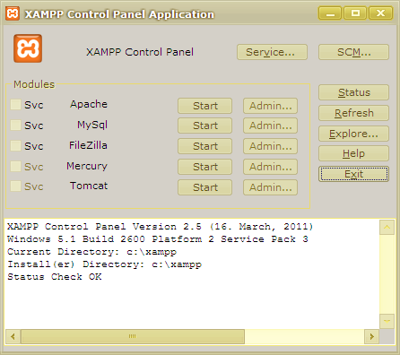
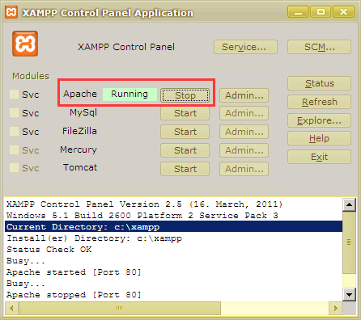
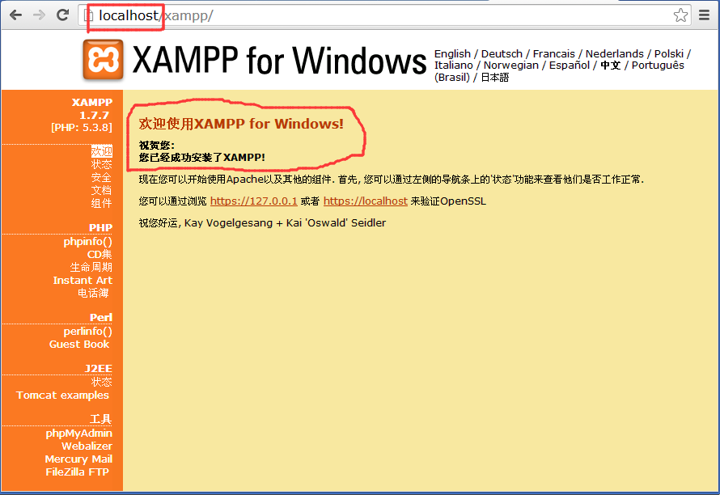
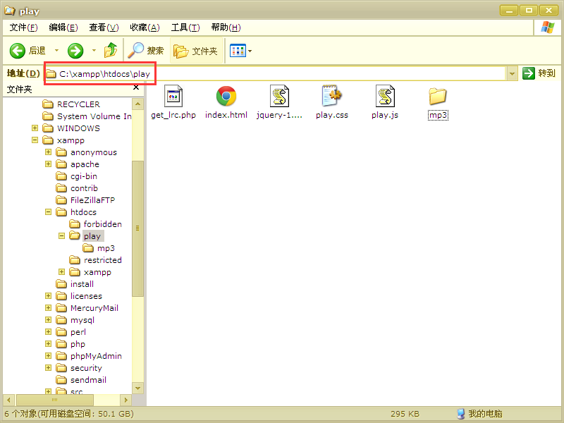

# 第 2 节 win 一键安装服务器

## 一、实验说明

上次实验我们做了一个炫酷的播放器，但是很遗憾，虚拟机的环境不支持 MP3 播放，所以不能看到效果。同时虚拟机也是暂时用的，不能保存数据，如果每次对播放器做了修改，都要重新部署代码，那得多烦啊。所以本次实验就教大家如何在自己的 window 电脑上安装服务器。这样，大家就可以随时在自己电脑上使用播放器了。

还可以让你的播放器在局域网也能访问，大家也可以在线听歌曲了。

>如果你在学习过程中遇到问题，或是本项目代码无法在你电脑运行，又或者你有更好的想法，或是你发现了本代码的 bug，都可以随时发邮件和我取得联系，大家一起学习进步，我的邮箱：1260022720@qq.com，请注明 @实验楼的朋友。

## 二、项目实战

### 1\. 下载服务器软件

首先下载服务器软件，这里我们使用集成的服务器软件，一键全部安装，省去了手动配置的步骤，还不易出错。对新手来说很容易使用。

#### （1）XP

如果你的系统是 xp 的，请下载 [xampp-win32-1.8.1-VC9-installer](http://heanet.dl.sourceforge.net/project/xampp/XAMPP%20Windows/1.8.1/xampp-win32-1.8.1-VC9-installer.exe) 或 V1.8.1 以前版本的，因为从 php5.5 开始，已经不支持 xp 系统了。

#### （2）Win7 及以上

win7 或以上系统的用户请直接下载 [xampp-win32-1.8.3-VC11-installer](http://dlsw.baidu.com/sw-search-sp/soft/0e/12489/xampp-win32-1.8.3-0-VC11-installer.exe?version=2216780340) 最新版。 点击上面的链接直接下载，哪个版本都可以，只要可以安装在你系统上。

### 2\. 安装服务器

打开刚刚下载的软件，双击运行。全部设置为默认，一直下一步就可以了。如果你更改了这些设置，可能会运行有问题。

**注意！安装路径不要改，默认是 C 盘，除非你对本软件很熟悉。我还是建议大家全部默认安装好了。**

安装好软件之后打开软件，你会看到如下的界面：



点击 Apache 右边的 start 按钮，看到如下的提示，就说明启动服务器了。php 已经集成在 Apache 里面了，所以只要启动 Apache 一个服务就可以运行我们的播放器了。



好了，现在我们再确定下你的服务器是否启动成功。打开 Chrome 或 Firefox 浏览器，如果你使用别的浏览器也是可以的。不过要获得本播放器的最佳使用体验和全部效果，建议你还是选择 Chrome。在地址栏输入 localhost 按回车，如果你看到如下的欢迎页面，恭喜你，你的服务器启动成功了。



### 3\. 部署播放器

万事俱备，只欠播放器代码。现在把我们的播放器代码全部复制到服务器目录下面，部署就完成了。打开软件，点击最右边的 explore 按钮，打开服务器目录，然后进入 htdocs 文件夹，现在把我们的播放器整个 play 文件夹复制到这里。就全部安装好了。



## 三、最重要的一步

现在全部工作都完成了，就差最后一小步了。上次实验我们说了，要在 window 服务器下运行，需要更改两句代码，解决字符编码的问题。只要更改 get_lrc.php 一个文件就可以了。

下面是更改后的 get_lrc.php：

```js
<?php
header('content="text/html;charset=utf-8"');
$lrc_file_name = $_GET['name'];
$method = $_GET['method'];

if($method == "get_lyric_data"){                //获取指定歌词名的歌词内容
    if($lrc_file_name == "")
    {
        echo "{";
        echo "\"state\":\"wrong\",";
        echo "\"message\":\"no lrc filename\"";
        echo "}";
    } else{
        $path="mp3/".$lrc_file_name;
        $path=iconv("utf-8", "gb2312", $path);
        //这个函数的作用是把$path 从“uft8”转换成"bg2312"编码，然后返回转换后的字符串
        //如果是在 window 下服务器运行，则需要把$path 从 utf-8 转换成 bg2312 编码
        //因为 window 默认字符集是 bg2312，而我们网页上用的是 utf-8，要不然 php 将找不到文件
        if( file_exists($path) )
        {
            $file = fopen($path, "r");
            $lrc_data="";
            while (!(feof($file)))
            {
                $text=fgets($file);
                $text=preg_replace("/\n/","", $text);
                $text=preg_replace("/\r\n/","", $text);
                //preg_replace()是正则替换，/\n/是正则表达式，函数作用是用第二个参数去
                //替换正则匹配的结果，在这里的作用就是把$text 的换行替换成“”,也就是空字符
                //因为使用 json 传送歌词，而 json 格式不允许包含换行符，不然会报错
                //注意：window 下和 Linux 下的换行是不同的，window 下是\r\n，而 Linux 是\n，
                //所以这里要注意不同的环境要相应的改动一下
                $lrc_data=$lrc_data.$text.",";
            }
            fclose($file);
            echo "{";
            echo "\"state\":\"success\",";
            echo "\"message\":\"all have done\",";
            echo "\"lrc\":\"".$lrc_data."\"";
            echo "}";
        }else{
            echo "{";
            echo "\"state\":\"success\",";
            echo "\"message\":\"can not open file\",";
            echo "\"lrc\":\"          暂时没有歌词 稍后我会添加 sorry\"";
            echo "}";
        }
    }
}else if($method == "get_music_list"){        //获取所有歌曲列表
    $dir="./mp3";
    //你存放 MP3 和歌词的目录
    $handle=opendir($dir);
    //PHP 遍历文件夹下所有文件 
    $list = array();
    //定义用于存储文件名的数组
    while (false !== ($file = readdir($handle)))
    {
        if ($file!="." && $file!=".." && (substr($file,-3)=="mp3" || substr($file,-3)=="ogg") ){
            //这里我们只要 mp3 和 ogg 文件，并且过滤掉.和..，它们分别表示下一级目录和上一级目录
            $list[] = $file;
            //将文件名保存到 list 数组
        }
    }
    closedir($handle);
    echo "{";
    echo "\"state\":\"success\",";
    echo "\"music_list\":[";
    $list_length = count($list);
    for ($i=0; $i < $list_length; $i++) { 
        echo "\"".iconv("gb2312", "utf-8", $list[$i])."\"";
        //echo "\"".$list[$i]."\"";
        //注意，如果系统默认字符集不是 utf-8，需要把$list[$i]转换成 utf-8 编码
        //比如你是在 window 下服务器运行的，就要加上这句了，不然会乱码
        if($i != ($list_length-1) )
            echo ",";
    }
    echo "]";
    echo "}";
}else{                                                //给的 method 参数不符
    echo "{";
    echo "\"state\":\"wrong\",";
    echo "\"message\":\"no such method\"";
    echo "}";
}

?> 
```

我们改了三处地方。

第一处在 15 行：`//$path=iconv("utf-8", "gb2312", $path);` 我们把它前面的注释（也就是前面的//）去掉，这样就会把 path 转换为 gb2312 编码，php 就能找到这个文件了。

第二处在 23 行：`$text=preg_replace("/\n/","", $text);` 我们在它下面增加了一句：`$text=preg_replace("/\r\n/","", $text);` 因为有的歌词文件是在 Linux 环境下 编辑的，有的可能是在 window 下编辑的，为了保证所有可能性，我们把所有的都过滤掉。

第三次是 59 行和 60 行：

```js
//echo "\"" iconv("gb2312", "utf-8", $list[$i])."\"";
echo "\"".$list[$i]."\""; 
```

我们把 59 行的注释去掉，给 60 行添加注释

```js
echo "\"".iconv("gb2312", "utf-8", $list[$i])."\"";
//echo "\"".$list[$i]."\""; 
```

这样就可以了。大家要仔细对照上面的代码，字符编码问题最头疼了，也是最麻烦的问题之一。出现了问题后大家可以自己尝试调试，比如最有效的就是把变量输入，看是不是预期的变量值。对付编码问题也只能这样了。

## 四、大功告成

在浏览器输入

```js
localhost/play/index.html 
```

就可以看到播放器，大家把歌词和歌曲文件全部放到 mp3 文件夹中就可以全部读取出来了。