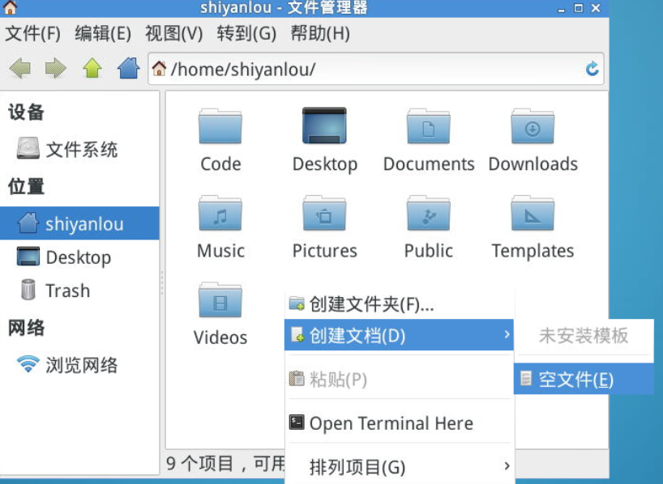
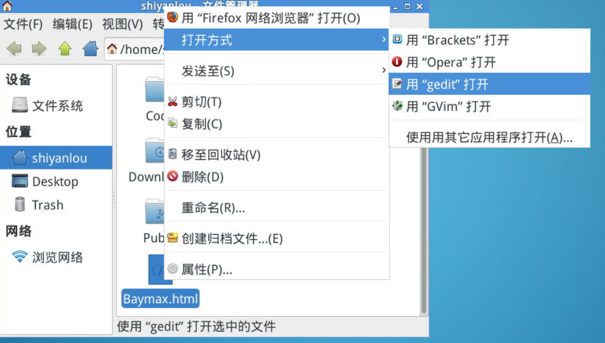
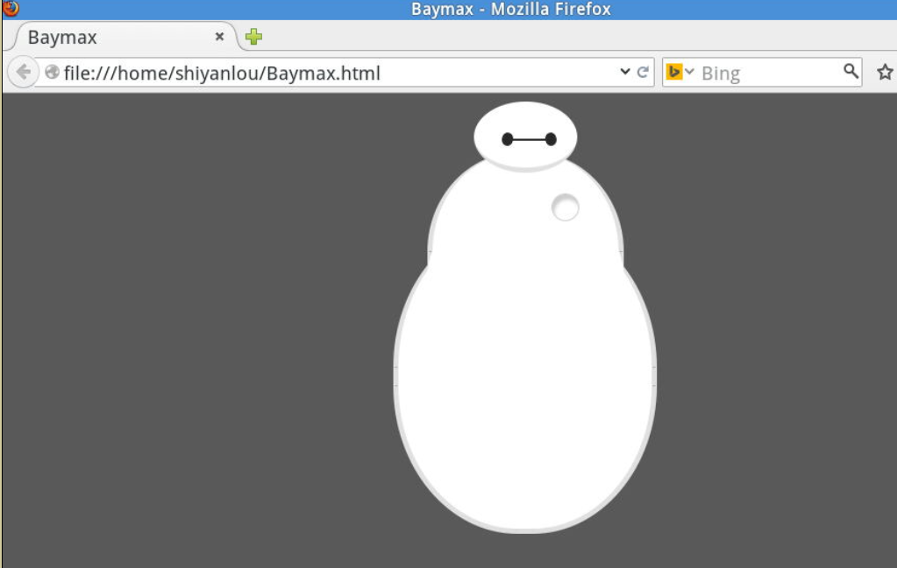
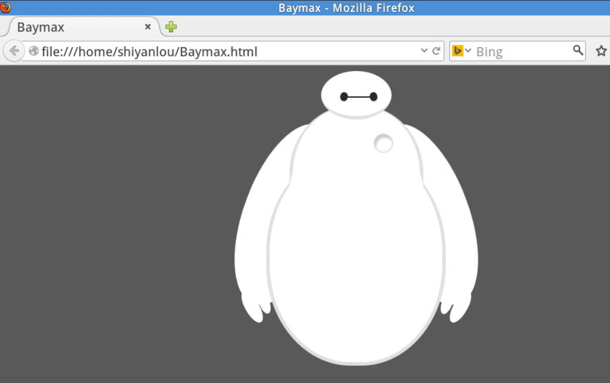
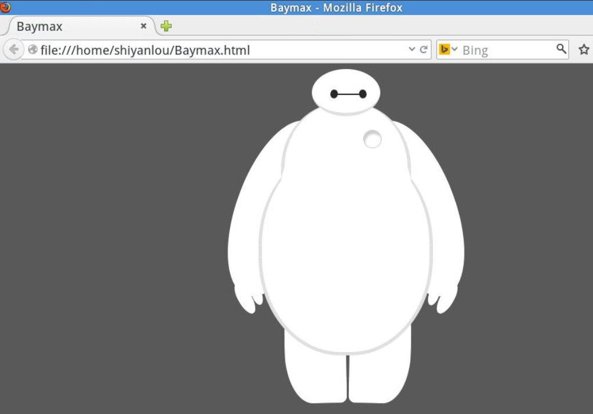

# 第 1 节 打造网页版「大白」

* * *

## 一、实验介绍

**1\. 环境介绍**

本实验环境采用带桌面的 Ubuntu Linux 环境，实验中可能会用到桌面上的程序：

*   Firefox：浏览器，可以用在需要前端界面的课程里，只需要打开环境里写的 HTML/JS 页面即可；
*   GVim：非常好用的编辑器，最简单的用法可以参考课程 [Vim 编辑器](http://www.shiyanlou.com/courses/2)。

**2\. 实验说明**

还记得《超能陆战队》里的 “暖男” -「大白」 么？是不是很想拥有一个？

没问题！今天我们就利用 HTML 和 CSS 来打造自己的「大白」！

PS：您最好对 HTML 和 CSS 有一定的了解，但如果你是小白也没关系，小白见「大白」也是可以的！

## 二、准备工作

进入到 `/home/shiyanlou/` 目录下，新建空白文档：



命名为 `Baymax.html` （其它名字也可以，但后缀名必须是 `.html`）：


使用 gedit 打开，准备编辑代码：



## 三、编写 HTML

填写以下代码：

```
<!doctype html>
<html>

<head>
<meta charset="utf-8">
<title>Baymax</title>
</head>

<body>
    <div id="baymax">

        <!-- 定义头部，包括两个眼睛、嘴 -->
        <div id="head">
            <div id="eye"></div>
            <div id="eye2"></div>
            <div id="mouth"></div>
        </div>

        <!-- 定义躯干，包括心脏 -->
        <div id="torso">
            <div id="heart"></div>
        </div>

        <!-- 定义肚子腹部，包括 cover（和躯干的连接处） -->
        <div id="belly">
            <div id="cover"></div>
        </div>

        <!-- 定义左臂，包括一大一小两个手指 -->
        <div id="left-arm">
            <div id="l-bigfinger"></div>
            <div id="l-smallfinger"></div>
        </div>

        <!-- 定义右臂，同样包括一大一小两个手指 -->
        <div id="right-arm">
            <div id="r-bigfinger"></div>
            <div id="r-smallfinger"></div>
        </div>

        <!-- 定义左腿 -->
        <div id="left-leg"></div>

        <!-- 定义右腿 -->
        <div id="right-leg"></div>

    </div>
</body>

</html> 
```

## 四、添加 CSS 样式

我们已经使用 HTML 定义好「大白」的各个元素，现在就需要利用到 CSS 来绘制它的样式外表。

由于「大白」是白色的，为了更容易辨识，我们把背景设为深色。然后首先是头部：

```
<style>

body {
    background: #595959;
}

#baymax {

    /*设置为 居中*/
    margin: 0 auto;

    /*高度*/
    height: 600px;

    /*隐藏溢出*/
    overflow: hidden;
}

#head {
    height: 64px;
    width: 100px;

    /*以百分比定义圆角的形状*/
    border-radius: 50%;

    /*背景*/
    background: #fff;

    margin: 0 auto;
    margin-bottom: -20px;

    /*设置下边框的样式*/
    border-bottom: 5px solid #e0e0e0;

    /*属性设置元素的堆叠顺序；
    拥有更高堆叠顺序的元素总是会处于堆叠顺序较低的元素的前面*/
    z-index: 100;

    /*生成相对定位的元素*/
    position: relative;
}
</style> 
```

效果预览：


赶紧再来添加眼睛和嘴吧！

```
#eye,
#eye2 {
    width: 11px;
    height: 13px;
    background: #282828;
    border-radius: 50%;
    position: relative;
    top: 30px;
    left: 27px;

    /*旋转该元素*/
    transform: rotate(8deg);
}

#eye2 {

    /*使其旋转对称*/
    transform: rotate(-8deg);
    left: 69px;
    top: 17px;

}

#mouth {
    width: 38px;
    height: 1.5px;
    background: #282828;
    position: relative;
    left: 34px;
    top: 10px;
} 
```

一个 mini 的「大白」，雏形初现：


接下来是躯干和腹部：

```
#torso,
#belly {
    margin: 0 auto;
    height: 200px;
    width: 180px;
    background: #fff;
    border-radius: 47%;

    /*设置边框*/
    border: 5px solid #e0e0e0;
    border-top: none;
    z-index: 1;
}

#belly {
    height: 300px;
    width: 245px;
    margin-top: -140px;
    z-index: 5;
}

#cover {
    width: 190px;
    background: #fff;
    height: 150px;
    margin: 0 auto;
    position: relative;
    top: -20px;
    border-radius: 50%;
} 
```

赋予「大白」象征生命的心脏：

```
#heart{
  width:25px; 
  height:25px; 
  border-radius:50%; 
  position:relative; 

  /*向边框四周添加阴影效果*/
  box-shadow:2px 5px 2px #ccc inset; 

  right:-115px; 
  top:40px; 
  z-index:111; 
  border:1px solid #ccc;
} 
```

现在的「大白」是这个样子的了：



还没有手和脚，怪萌怪萌的...「大白」需要温暖的手臂：

```
#left-arm,
#right-arm {
    height: 270px;
    width: 120px;
    border-radius: 50%;
    background: #fff;
    margin: 0 auto;
    position: relative;
    top: -350px;
    left: -100px;
    transform: rotate(20deg);
    z-index: -1;
}

#right-arm {
    transform: rotate(-20deg);
    left: 100px;
    top: -620px;
} 
```

还没有手指头呢：

```
#l-bigfinger,
#r-bigfinger {
    height: 50px;
    width: 20px;
    border-radius: 50%;
    background: #fff;
    position: relative;
    top: 250px;
    left: 50px;
    transform: rotate(-50deg);
}

#r-bigfinger {
    left: 50px;
    transform: rotate(50deg);
}

#l-smallfinger,
#r-smallfinger {
    height: 35px;
    width: 15px;
    border-radius: 50%;
    background: #fff;
    position: relative;
    top: 195px;
    left: 66px;
    transform: rotate(-40deg);
}

#r-smallfinger {
    background: #fff;
    transform: rotate(40deg);
    top: 195px;
    left: 37px;
} 
```

有点意思了：



迫不及待要给「大白」加上腿了吧：

```
#left-leg,
#right-leg {
    height: 170px;
    width: 90px;
    border-radius: 40% 30% 10px 45%;
    background: #fff;
    position: relative;
    top: -640px;
    left: -45px;
    transform: rotate(-1deg);
    z-index: -2;
    margin: 0 auto;
}

#right-leg {
    background: #fff;
    border-radius:30% 40% 45% 10px;
    margin: 0 auto;
    top: -810px;
    left: 50px;
    transform: rotate(1deg);
} 
```

**最后贴出完整的代码：**

```
<!doctype html>
<html>

<head>
<meta charset="utf-8">
<title>Baymax</title>

<style>
body {
    background: #595959;
}

#baymax {

    /*设置为 居中*/
    margin: 0 auto;

    /*高度*/
    height: 600px;

    /*隐藏溢出*/
    overflow: hidden;
}

#head {
    height: 64px;
    width: 100px;

    /*以百分比定义圆角的形状*/
    border-radius: 50%;

    /*背景*/
    background: #fff;
    margin: 0 auto;
    margin-bottom: -20px;

    /*设置下边框的样式*/
    border-bottom: 5px solid #e0e0e0;

    /*属性设置元素的堆叠顺序；
    拥有更高堆叠顺序的元素总是会处于堆叠顺序较低的元素的前面*/
    z-index: 100;

    /*生成相对定位的元素*/
    position: relative;
}

#eye,
#eye2 {
    width: 11px;
    height: 13px;
    background: #282828;
    border-radius: 50%;
    position: relative;
    top: 30px;
    left: 27px;

    /*旋转该元素*/
    transform: rotate(8deg);
}

#eye2 {

    /*使其旋转对称*/
    transform: rotate(-8deg);
    left: 69px;
    top: 17px;

}

#mouth {
    width: 38px;
    height: 1.5px;
    background: #282828;
    position: relative;
    left: 34px;
    top: 10px;
}

#torso,
#belly {
    margin: 0 auto;
    height: 200px;
    width: 180px;
    background: #fff;
    border-radius: 47%;

    /*设置边框*/
    border: 5px solid #e0e0e0;
    border-top: none;
    z-index: 1;
}

#belly {
    height: 300px;
    width: 245px;
    margin-top: -140px;
    z-index: 5;
}

#cover {
    width: 190px;
    background: #fff;
    height: 150px;
    margin: 0 auto;
    position: relative;
    top: -20px;
    border-radius: 50%;
}

#heart{
  width:25px; 
  height:25px; 
  border-radius:50%; 
  position:relative; 

  /*向边框四周添加阴影效果*/
  box-shadow:2px 5px 2px #ccc inset; 

  right:-115px; 
  top:40px; 
  z-index:111; 
  border:1px solid #ccc;
}

#left-arm,
#right-arm {
    height: 270px;
    width: 120px;
    border-radius: 50%;
    background: #fff;
    margin: 0 auto;
    position: relative;
    top: -350px;
    left: -100px;
    transform: rotate(20deg);
    z-index: -1;
}

#right-arm {
    transform: rotate(-20deg);
    left: 100px;
    top: -620px;
}

#l-bigfinger,
#r-bigfinger {
    height: 50px;
    width: 20px;
    border-radius: 50%;
    background: #fff;
    position: relative;
    top: 250px;
    left: 50px;
    transform: rotate(-50deg);
}

#r-bigfinger {
    left: 50px;
    transform: rotate(50deg);
}

#l-smallfinger,
#r-smallfinger {
    height: 35px;
    width: 15px;
    border-radius: 50%;
    background: #fff;
    position: relative;
    top: 195px;
    left: 66px;
    transform: rotate(-40deg);
}

#r-smallfinger {
    background: #fff;
    transform: rotate(40deg);
    top: 195px;
    left: 37px;
}

#left-leg,
#right-leg {
    height: 170px;
    width: 90px;
    border-radius: 40% 30% 10px 45%;
    background: #fff;
    position: relative;
    top: -640px;
    left: -45px;
    transform: rotate(-1deg);
    z-index: -2;
    margin: 0 auto;
}

#right-leg {
    background: #fff;
    border-radius:30% 40% 45% 10px;
    margin: 0 auto;
    top: -810px;
    left: 50px;
    transform: rotate(1deg);
}

</style>

</head>

<body>
    <div id="baymax">

        <!-- 定义头部，包括两个眼睛、嘴 -->
        <div id="head">
            <div id="eye"></div>
            <div id="eye2"></div>
            <div id="mouth"></div>
        </div>

        <!-- 定义躯干，包括心脏 -->
        <div id="torso">
            <div id="heart"></div>
        </div>

        <!-- 定义肚子腹部，包括 cover（和躯干的连接处） -->
        <div id="belly">
            <div id="cover"></div>
        </div>

        <!-- 定义左臂，包括一大一小两个手指 -->
        <div id="left-arm">
            <div id="l-bigfinger"></div>
            <div id="l-smallfinger"></div>
        </div>

        <!-- 定义右臂，同样包括一大一小两个手指 -->
        <div id="right-arm">
            <div id="r-bigfinger"></div>
            <div id="r-smallfinger"></div>
        </div>

        <!-- 定义左腿 -->
        <div id="left-leg"></div>

        <!-- 定义右腿 -->
        <div id="right-leg"></div>

    </div>
</body>

</html> 
```

duang~ duang~ duang~ 特技完成！



## 五、小结

> 据说妹纸们对「大白」毫无抵抗力，汉纸们还不学起来！（我只能帮你到这儿了...）

> 但是如果你们赞得多，我就再教你一招：让「大白」对你眨(fang)眼(dian)！就看你们给力不给力了...

## 六、参考

> * [Baymax](http://jsdm.com/jsw/paint/P1t7n)