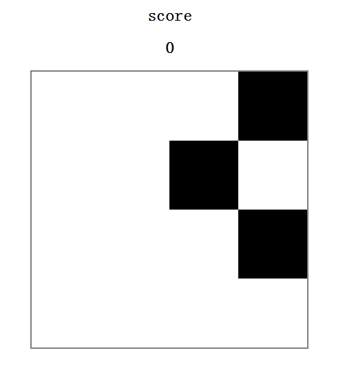
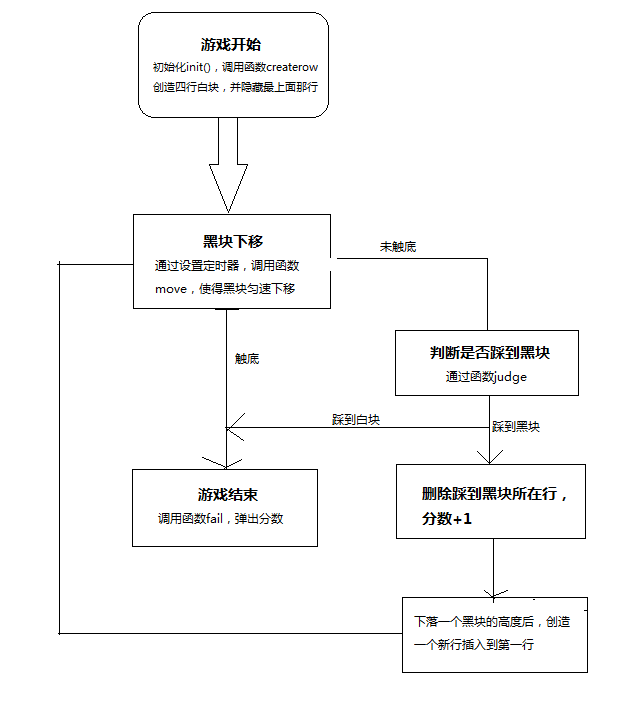
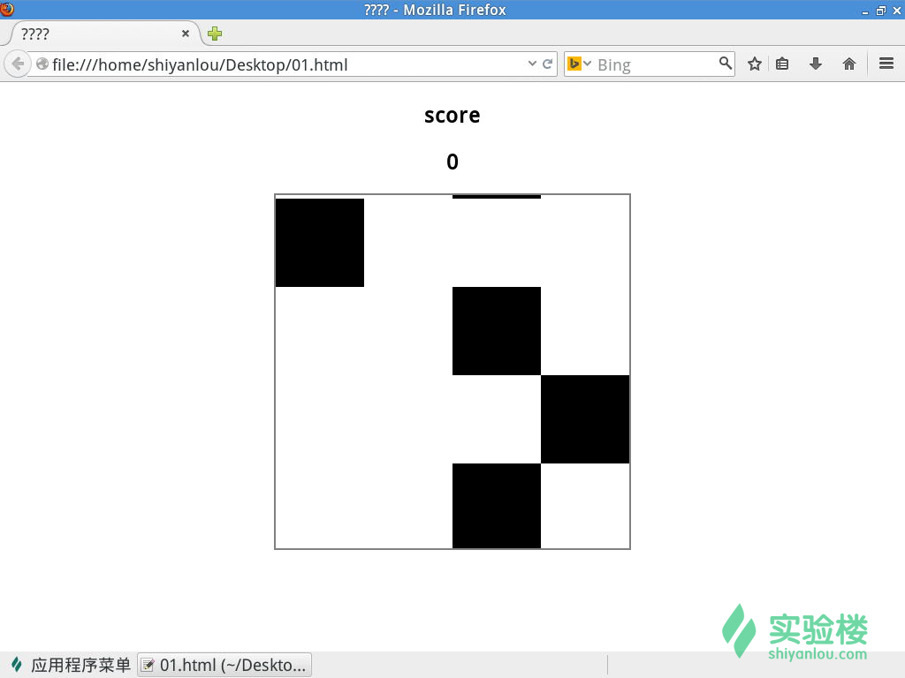

# 第 1 节 网页版 别踩白块

## 一、实验说明

### 1\. 环境登录

无需密码自动登录，系统用户名 shiyanlou

### 2\. 环境介绍

本实验环境采用带桌面的 Ubuntu Linux 环境，实验中会用到桌面上的程序：

1.  LX 终端（LXTerminal）: Linux 命令行终端，打开后会进入 Bash 环境，可以使用 Linux 命令。

2.  Firefox：浏览器，可以用在需要前端界面的课程里，只需要打开环境里写的 HTML/JS 页面即可。

3.  GVim：非常好用的编辑器，最简单的用法可以参考课程[Vim 编辑器](http://www.shiyanlou.com/courses/2)。

### 3\. 环境使用

使用 GVim 编辑器输入实验所需的代码及文件，使用 LX 终端（LXTerminal）运行所需命令进行操作。

实验报告可以在个人主页中查看，其中含有每次实验的截图及笔记，以及每次实验的有效学习时间（指的是在实验桌面内操作的时间，如果没有操作，系统会记录为发呆时间）。这些都是您学习的真实性证明。

## 二、项目介绍

别踩白块这个游戏相信很多人都在手机上玩过，今天我们就来做一个网页版的，先上一张游戏效果图，看看你有没有兴趣去实现这样一个小游戏。为了使代码尽量简单，逻辑清晰，去掉了很多的事件控制按钮，刷新页面即可以开始游戏，只保留了实现这个小游戏最重要的部分代码，让初学者也能很快看懂。 

## 三、项目实战

**1\. 思路分析** 我一般写 js 小游戏的思路是，先用 HTML 和 css 在游览器中将自己想要的静态效果写出来，然后再考虑如何用 js 来控制页面中各个元素的变化实现动态的游戏效果。所以参照手机 APP 版“别踩白块”，可以用通过 HTML 和 css 代码实现相似的静态效果。

**2\. html+css 部分** 可以用 div+css 布局来实现别踩白块的静态效果展示，直接上 HTML 代码，我来简要说下 HTML 思路，将主界面分解成一个 4x4 的大矩形格子，每一个方块代表其中一个小的矩形格，其中每一行的四个白块中有一个黑块，每一行中黑块位于那一列是随机生成的，但是我们这里现在是静态页面就自己确定了，然后通过 css 控制样式。

```
 <div id="main">
        <div id="con">
            <div class="row">
                <div class="cell"></div>/*白块*/
                <div class="cell black"></div>/*黑块*/
                <div class="cell"></div>
                <div class="cell"></div>
            </div>
            <div class="row">
                <div class="cell"></div>
                <div class="cell black"></div>
                <div class="cell"></div>
                <div class="cell"></div>
            </div>
            <div class="row">
                <div class="cell"></div>
                <div class="cell"></div>
                <div class="cell black"></div>
                <div class="cell"></div>
            </div>
            <div class="row">
                <div class="cell black"></div>
                <div class="cell"></div>
                <div class="cell"></div>
                <div class="cell"></div>
            </div>
        </div>
    </div> 
```

下面是 css 代码，这里有一个要注意的地方，我将 div#con 块级元素向上提了 100px，这样在游戏的开始就出现了最底一行的空白，隐藏最上面那行，为什么要这样呢，继续往下看就知道了。

```
 #main {
        width: 400px;
        height: 400px;
        background: white;
        border: 2px solid gray;
        margin: 0 auto;
        overflow: hidden;
    }

    #con {
        width: 100%;
        height: 400px;
        position: relative;
        top: -100px; /*隐藏最上层的那行*/
        border-collapse:collapse;
    }

    .row{
        height: 100px;
        width: 100%;
    }

    .cell{
        height: 100px;
        width: 100px;
        float: left;
    }

    .black {
        background: black;
    } 
```

如果以上部分你都能够理解并且对应着代码实现的话，那么你现在应该会出现这样的效果。是不是很像别踩白块的界面了呢，我们已经成功了一大步，然后就是通过 js 来实现别踩白块的一些事件以及响应啦。


**3\. JavaScript 部分** 在开始 js 编程之前，让我们先来分析下整个游戏的流程：在普通游戏玩家眼中，应该是游戏开始，黑块以一定的速度下移，点击黑块，黑块消失，新的黑块不断向下移动，若黑块触底则游戏结束；

而以开发者来说，**应将每一个黑块和白块抽象成一个个的数据结构，黑块的消失和出现其实就是数据结构的创造和销毁**，我们来看一张游戏的流程图，对于要编写的 js 功能有一个大概的了解 

**3.1 游戏初始化**

根据前面的 HTML 部分我们可以知道，每个`<div class="cell">`就代表一个白块，`<div class="cell black">`就代表一个黑块，每点击一个黑块消失其实是删除了一个`<div class="row">` 然后从上面添加一个新的`<div class="row">`所以我们首先要通过 js 来控制`<div class="row">`的创造和生成（记得删除在编写静态页面时候指定生成的 4 个`div.row`）。具体方法如下：

```
 //创建 div, 参数 className 是其类名
    function creatediv(className){
        var div = document.createElement('div');
        div.className = className;
        return div;
    }

    // 创造一个<div class="row">并且有四个子节点<div class="cell">
    function createrow(){
        var con = $('con');
        var row = creatediv('row'); //创建 div className=row
        var arr = creatcell(); //定义 div cell 的类名,其中一个为 cell black

        con.appendChild(row); // 添加 row 为 con 的子节点

        for(var i = 0; i < 4; i++){
            row.appendChild(creatediv(arr[i])); //添加 row 的子节点 cell
        }

        if(con.firstChild == null){
            con.appendChild(row);
        }else{
            con.insertBefore(row, con.firstChild);
        }
    }

    //删除 div#con 的子节点中最后那个<div class="row"> 
    function delrow(){
            var con = $('con');
            if(con.childNodes.length == 6) {
                con.removeChild(con.lastChild);
            }
        }   

    //创建一个类名的数组，其中一个为 cell black, 其余为 cell
    function creatcell(){
        var temp = ['cell', 'cell', 'cell', 'cell',];
        var i = Math.floor(Math.random()*4);//随机生成黑块的位置
        temp[i] = 'cell black';
        return temp;
    } 
```

**3.2 让黑块动起来**

在可以通过 js 来创造和销毁`div`后，我们就要让黑块动起来，这个时候我们就用到了之前 css 提到的设定`<div id="con">`隐藏了一行的`<div id="row">`，我们通过 js 的 DOM 操作使其向下方移动，并设置定时器每 30 毫秒移动一次，这样就实现了黑块的平滑移动，在黑块移动的同时，我们要判断黑块是否已经触底，触底则游戏失败，停止调用`move()`，触底后调用函数`fail()`游戏失败，具体方法如下

```
 //使黑块向下移动   
    function move(){
        var con = $('con');
        var top = parseInt(window.getComputedStyle(con, null)['top']);

        if(speed + top > 0){
            top = 0;
        }else{
            top += speed;
        }           
        con.style.top = top + 'px';

        if(top == 0){
            createrow();
            con.style.top = '-100px';
            delrow();
        }else if(top == (-100 + speed)){
            var rows = con.childNodes;
            if((rows.length == 5) && (rows[rows.length-1].pass !== 1) ){
                fail();
            }
        }
    }

    function fail(){
            clearInterval(clock);
            confirm('你的最终得分为 ' + parseInt($('score').innerHTML) );
        } 
```


**3.3 判断是否点击到黑块**

让黑块动起来之后呢，我们就来考虑怎么判断用户有没有点击到黑块呢，同时用户若点击到黑块我们要让所在那一行消失，那么我们需要一个`judge`方法，具体如下

```
//判断用户是否点击到了黑块，
function judge(ev){
    if(ev.target.className.indexOf('black') == -1){
        pass;
    }else{
        ev.target.className = 'cell';
        ev.target.parentNode.pass = 1; //定义属性 pass，表明此行 row 的黑块已经被点击
        score();
    }
} 
```

其实程序写到这里，几个核心的功能点都已经实现了，是不是感觉很简单呢，剩下来的就是将这些方法组合起来，组成完整的逻辑关系，在我给出的源码里有添加一个记分器记录用户分数的功能，同时设置加速方法，使黑块的移动越来越快等等，有兴趣的的同学可以尝试着添加事件按钮，使这个游戏更接近 APP 版本。 

> 有问题的同学可以在评论区留言，我会不定时回复

以下是课程项目完成源代码，同学们可以下载参考，为了方便我将起放到了一个 html 文件中

**源代码**

```
<!DOCTYPE html>
<html>
<head>
    <meta charset="utf-8">
    <title>别踩白块</title>
    <style type="text/css">
        #score{
            text-align: center;}

        h2 {
            text-align: center; }

        div{
            margin: 0 auto;
            width: 100px;
            height: 100px;}

        #main {
            width: 400px;
            height: 400px;
            background: white;
            border: 2px solid gray;
            margin: 0 auto;
            position: relative;
            overflow: hidden;}

        #con {
            width: 100%;
            height: 400px;
            position: relative;
            top: -100px;
            border-collapse:collapse;}

        .row{
            height: 100px;
            width: 100%;}

        .cell{
            height: 100px;
            width: 100px;
            float: left;}

        .black {
            background: black;}
    </style>
</head>
<body>

    <h2>score</h2>
    <h2 id="score">0</h2>
    <div id="main">
        <div id="con"></div>
    </div>
</body>
<script>
    var clock = null;
    var state = 0;
    var speed = 4;

        /*
        *   初始化 init
        */
        function init(){
            for(var i=0; i<4; i++){
                createrow();
            }

            // 添加 onclick 事件
            $('main').onclick = function(ev){
                judge(ev);
            }

            // 定时器 每 30 毫秒调用一次 move()
                clock = window.setInterval('move()', 30);
        }

        // 判断是否点击黑块
        function judge(ev){
            if(ev.target.className.indexOf('black') == -1){
                // ev.target.className = 'cell red';
                // fail();
                pass;
            }else{
                ev.target.className = 'cell';
                ev.target.parentNode.pass = 1; //定义属性 pass，表明此行 row 的黑块已经被点击
                score();
            }
        }

        // 游戏结束
        function fail(){
            clearInterval(clock);
            confirm('你的最终得分为 ' + parseInt($('score').innerHTML) );
        }

        // 创建 div, className 是其类名
        function creatediv(className){
            var div = document.createElement('div');
            div.className = className;
            return div;
        }

        // 创造一个<div class="row">并且有四个子节点<div class="cell">
        function createrow(){
            var con = $('con');
            var row = creatediv('row'); //创建 div className=row
            var arr = creatcell(); //定义 div cell 的类名,其中一个为 cell black

            con.appendChild(row); // 添加 row 为 con 的子节点

            for(var i = 0; i < 4; i++){
                row.appendChild(creatediv(arr[i])); //添加 row 的子节点 cell
            }

            if(con.firstChild == null){
                con.appendChild(row);
            }else{
                con.insertBefore(row, con.firstChild);
            }
        }

        // 根据 id 来 get DOM 元素
        function $(id) {
            return document.getElementById(id);
        }

        // 创建一个类名的数组，其中一个为 cell black, 其余为 cell
        function creatcell(){
            var temp = ['cell', 'cell', 'cell', 'cell',];
            var i = Math.floor(Math.random()*4);
            temp[i] = 'cell black';
            return temp;
        }

        //让黑块动起来
        function move(){
            var con = $('con');
            var top = parseInt(window.getComputedStyle(con, null)['top']);

            if(speed + top > 0){
                top = 0;
            }else{
                top += speed;
            }           
            con.style.top = top + 'px';

            if(top == 0){
                createrow();
                con.style.top = '-100px';
                delrow();
            }else if(top == (-100 + speed)){
                var rows = con.childNodes;
                if((rows.length == 5) && (rows[rows.length-1].pass !== 1) ){
                    fail();
                }
            }
        }

        // 加速函数
        function speedup(){
            speed += 2;
            if(speed == 20){
                alert('你超神了');
            }
        }

        //删除某行
        function delrow(){
            var con = $('con');
            if(con.childNodes.length == 6) {
                con.removeChild(con.lastChild);
            }
        }   

        // 记分
        function score(){
            var newscore = parseInt($('score').innerHTML) + 1;
            $('score').innerHTML = newscore;
            if(newscore % 10 == 0){
                speedup();
            }
        }

    init();
</script>
</html> 
```