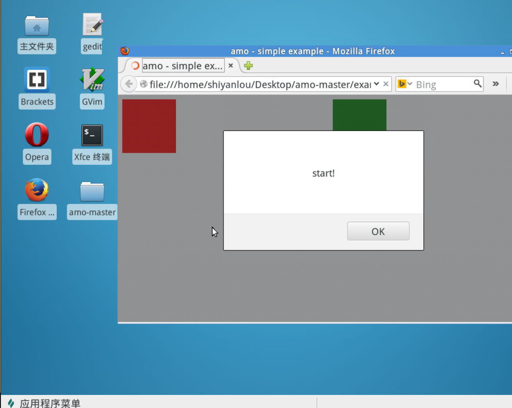

# 第 1 节 amo.js — 用于创建 CSS3 动画的 JS 库

## 一、实验说明

### 1\. 环境登录

无需密码自动登录，系统用户名 shiyanlou

### 2\. 环境介绍

本实验环境采用带桌面的 Ubuntu Linux 环境，实验中会用到桌面上的程序：

> * XfceTerminal: Linux 命令行终端，打开后会进入 Bash 环境，可以使用 Linux 命令

*   Firefox：浏览器，可以用在需要前端界面的课程里，只需要打开环境里写的 HTML/JS 页面即可
*   gedit：非常好用的编辑器

### 3\. 环境使用

使用 gedit 编辑器输入实验所需的代码，然后使用 XfceTerminal 命令行环境进行编译运行，查看运行结果，运行后可以截图并分享自己的实验成果，实验楼提供的截图是后台截图，无法作弊，可以真实有效证明您已经完成了实验。

实验报告可以在个人主页中查看，其中含有每次实验的截图及笔记，以及每次实验的有效学习时间（指的是在实验桌面内操作的时间，如果没有操作，系统会记录为发呆时间）。这些都是您学习的真实性证明。

### 4\. 实验简介

amo.js 是一个用于创建 CSS3 动画的 JS 库，源码只有 400 余行，压缩前 11kb。比起 JQuery 提供简单的 animate() 方法创建动画，amo.js 能给予开发者更大自主性，实现动画过程的对象化，动画对象节点使用原生 js 获取或者 jquery 获取都能应付自如。源码中引用一些 sea.js 插件用于在 js 代码中插入样式文本。

## 二、指南

### 1\. 引入 amo.js，适用于 webkit 内核浏览器

```js
<script src="./src/amo.js"></script> 
```

### 2\. 如何使用

```js
<script>
//1\. 找到需要产生动画的对象，这是个实体
var node = document.getElementById('animate-node');

//2\. 创建一个 css animation 动画对象
var fadeAnim = Amo.keyframes({
    'opacity': 0
}, {
    'opacity': 1
}).animate({
//help: http://www.w3schools.com/css/css3_animations.asp 查看 css 动画相关
    mode: 'forwards',
    duration: 1000,
    easing: 'ease',
    time: 1,
    delay: 1000,
    direction: 'alternate'
});

//3\. 运行一个 css animation 动画对象
fadeAnim.run(node, function() {
    console.log('over');
});
</script> 
```

## 三、详细

### 1\. Amo.keyframe

Amo.keyframe 和 css 的 [@keyframe](http://www.w3school.com.cn/cssref/pr_keyframes.asp) 的作用是一样的。

Demo1

```js
<script>
/*js*/
Amo.keyframes({
    top: '0px'
}, {
    top: '200px' 
});
</script> 
```

```js
<style>
/* css */
@keyframes mymove {
    from {top:0px;}
    to {top:200px;}
}
</style> 
```

Demo2

```js
<script>
/* js*/
Amo.keyframes({
    0: {
        top: '0px' 
    },
    50: {
        top: '100px'
    },
    100: {
        top: '200px'
    }
});
</script> 
```

```js
<style>
/* css */
@keyframes mymove {
    from {top:0px;}
    to {top:200px;}
}
</style> 
```

### 2\. keyframe.animate & animate.run

你也可以创建基于 keyframe 的 animate 对象。

Demo3

```js
<script>
/* js*/
var mymove = Amo.keyframes({
    0: {
        top: '0px' 
    },
    50: {
        top: '100px'
    },
    100: {
        top: '200px'
    }
});
var myAnim = mymove.animate({
    duration: 5000,
    easing: 'linear',
    delay: 2000,
    time: -1,
    direction: 'alternate'
});

//jq 和原生的 js 皆可
//$('#test') => ok
//document.getElementById('test') => ok
myAnim.run($('#test'), function() {
    console.log('animation over'); 
});
</script> 
```

```js
<style>
/* css */
@keyframes mymove {
    0%   {top:0px;}
    50%  {top:100px;}
    100% {top:20px;}
}
#test {
    animation: mymove 5s linear 2s infinite alternate;
}
</style> 
```

### 3\. animate instance 实例

```js
<script>
var myAnimIns = myAnim.run($('#test'), function() {
    console.log('animation over'); 
});

//停止动画
myAnimIns.stop();

//启动动画
myAnimIns.start();

//重置动画
myAnimIns.reset();
</script> 
```

**你不需要关注样式动画和 keyframes 的样式，关注动画本身是你唯一需要做的事情。**

## 四、使用

### 1\. 旋转


```js
<script>
//create keyframes
var rotateAnim = Amo.keyframes({
    'transform': 'rotate(0deg)'
}, {
    'transform': 'rotate(360deg)'
//create animate
}).animate({
    // animation iteration count
    time: -1,
    // animation timing function
    easing: 'linear'
});
//run animate & return animate instance
rotateAnim.run(document.getElementById('demo-1'));
</script> 
```

### 2\. 来回


```js
<script>
//create keyframes
var moveAnim = Amo.keyframes({
    left: '20px'
}, {
    left: '480px'
}).animate({
    time: -1,
    // animation-direction: normal|alternate;
    direction: 'alternate'
});

// animation instance
var moveAnimIns = moveAnim.run($('#demo-2'));
$('#btn-start').on('click', function(){
    // start the animation instance
    moveAnimIns.start();
});
$('#btn-stop').on('click', function(){
    // stop the animation instance
    moveAnimIns.stop();
});
</script> 
```

### 3\. 缩放


```js
<script>
//create keyframes
var sizeAnim = Amo.keyframes({
    'border-radius': '10px',
    width: '10px',
    height: '10px'
}, {
    'border-radius': '120px',
    width: '120px',
    height: '120px'
}).animate({
    //animate times
    time: 5,
    //animate duration at one time
    duration: 800,
    direction: 'alternate'
});

//callback
sizeAnim.run($('#demo-3'), function() {
    $('#demo-3').css('background', '#ddd');
});
 </script> 
```

### 4\. 变色


```js
<script>
//create keyframes
var colorAnim = Amo.keyframes({
    0: {
        'background-color': 'red'
    },
    20: {
       'background-color': 'green'
    },
    50: {
       'background-color': 'blue'
    },
    80: {
       'background-color': 'yellow'
    },
    100: {
       'background-color': 'gray'
    }
}).animate({
    time: -1,
    direction: 'alternate'
});

var demo4Ins = colorAnim.run($('.demo-4'));

 </script> 
```

## 五、Demo

为了更好的理解 amo.js 动画过程和实体独立的，实现一个简单的例子。

### 1\. 页面布局

test.html

```js
<!doctype html>
<html>
    <head>
        <meta charset="utf-8" />
        <title>amo - simple example</title>
        <style>
            #test, #test2 {
                background: red;
                position: absolute;
                width: 100px;
                height: 100px;
            }
            #test2 {
                left: 400px;
                background: green;
            }
        </style>
    </head>
    <body>
        <div id="test"></div>
        <div id="test2"></div>
    </body>
</html> 
```



### 2\. 引入 amo.js

```js
<script src="../src/amo.js"></script> 
```

### 3\. 设置动画和事件

这里我们使红色和绿色的两个 div 进行旋转 360 度，同时正方形的边长从 100 到 200 像素。重复五次，每次持续 5 秒。可以很清楚的看到动画的对象（animNode ）和过程进行了分离（rotateAnim ）。

```js
<script>
            var animNode = document.getElementsByTagName('div');

            var rotateAnim = Amo.keyframes({
                'transform': 'rotate(0deg)',
                'width': '100px',
                'height': '100px'

            }, {
                'transform': 'rotate(360deg)',
                'width': '200px',
                'height': '200px'
            }).animate({
                mode: 'forwards',
                duration: 5000,
                easing: 'linear',
                time: 5,
                delay: 1000
            });

            var animInstance = rotateAnim.run(animNode, function() {
                console.log('over');
            });
</script> 
```

然后我们在红色的 test1 上绑定事件，点击后 toggle 动画的停止和继续。

```js
<script>
            var t = false;
            document.getElementById('test').addEventListener('click', function() {
                t = !t;
                if ( t ) {
                    animInstance.stop();
                } else {
                    animInstance.start();
                }
            });
</script> 
```

具体效果如下图，可以很方便的实现过程的对象化：


完整代码如下：

```js
<!doctype html>
<html>
    <head>
        <meta charset="utf-8" />
        <title>amo - simple example</title>
        <style>
            #test, #test2 {
                background: red;
                position: absolute;
                width: 100px;
                height: 100px;
            }
            #test2 {
                left: 400px;
                background: green;
            }
        </style>
    </head>
    <body>
        <div id="test"></div>
        <div id="test2"></div>
        <script src="../src/amo.js"></script>
        <script>
            alert("开始了");
            var animNode = document.getElementsByTagName('div');

            var rotateAnim = Amo.keyframes({
                'transform': 'rotate(0deg)',
                'width': '100px',
                'height': '100px'

            }, {
                'transform': 'rotate(360deg)',
                'width': '200px',
                'height': '200px'
            }).animate({
                mode: 'forwards',
                duration: 5000,
                easing: 'linear',
                time: 5,
                delay: 1000
            });

            var animInstance = rotateAnim.run(animNode, function() {
                console.log('over');
            });

            var t = false;
            document.getElementById('test').addEventListener('click', function() {
                t = !t;
                if ( t ) {
                    animInstance.stop();
                } else {
                    animInstance.start();
                }
            });
        </script>
    </body>
</html> 
```

最后啰嗦一句，使用 amo.js 是得在支持 webkit 内核的浏览器上，虽然 demo 比较简单，但是可以对项目的架构有帮助，动画多的话甚至可以将动画打包成工具库。希望大家喜欢。

## 六、作业思考

实现其他的动画效果。

## 七、版权声明

amo.js 来自 [nikogu](https://github.com/nikogu) ，版权归作者所有。

amo.js 的 [首页](https://github.com/nikogu/amo) 和 [源码](https://github.com/nikogu/amo/blob/master/src/amo.js) 都开源在 github 上，欢迎大家 follow 和 star。